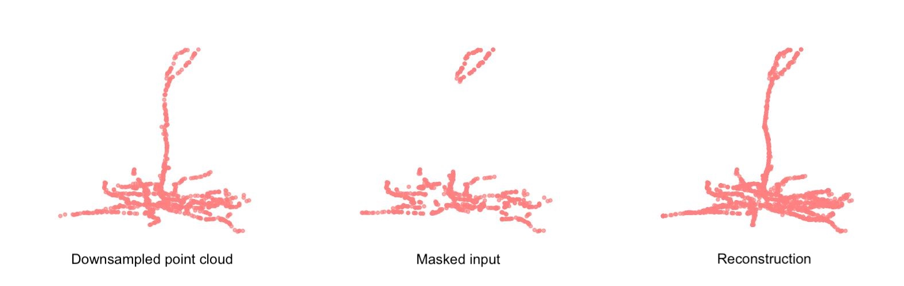

# Morph-MAE

This repo is based on "Masked Autoencoders for Point Cloud Self-supervised Learning", [ECCV 2022](https://www.ecva.net/papers/eccv_2022/papers_ECCV/papers/136620591.pdf), [ArXiv](https://arxiv.org/abs/2203.06604).
We apply the method to neuronal morphology data.

## 1. Requirements
PyTorch >= 1.7.0 < 1.11.0;
python >= 3.7;
CUDA >= 9.0;
GCC >= 4.9;
torchvision;

```
pip install -r requirements.txt
```

```
# Chamfer Distance & emd
cd ./extensions/chamfer_dist
python setup.py install --user
cd ./extensions/emd
python setup.py install --user
# PointNet++
pip install "git+https://github.com/erikwijmans/Pointnet2_PyTorch.git#egg=pointnet2_ops&subdirectory=pointnet2_ops_lib"
# GPU kNN
pip install --upgrade https://github.com/unlimblue/KNN_CUDA/releases/download/0.2/KNN_CUDA-0.2-py3-none-any.whl
```

## 2. Datasets

We use neuronal morphologies from MICrONS project. The dataset is structured as:
```
│pcs_v7_volume_rotation/
├──coords/
├──splits-2025-02-28/
│   ├──train.npy
│   ├──val.npy
│   ├──test.npy
├──labels_splits_80-10-10/
│   ├──train.npy
│   ├──val.npy
│   ├──test.npy
├──df_labels_Microns_v7.pkl
├──df_labels_spine_densitites.pkl
├──idsplit2soma.pkl
├──normalizing_constants.pkl
├──.......
```


## 4. Point-MAE Training
To pretrain Point-MAE on ShapeNet training set, run the following command. If you want to try different models or masking ratios etc., first create a new config file, and pass its path to --config.

```
CUDA_VISIBLE_DEVICES=<GPU> python main.py --config cfgs/pretrain.yaml --exp_name <output_file_name>
```

To fine-tune the model, run:
```
CUDA_VISIBLE_DEVICES=<GPUs> python main.py --config cfgs/finetune.yaml \
--finetune_model --exp_name <output_file_name> --ckpts <path/to/pre-trained/model>
```

## 6. Visualization

Visulization of pre-trained model on validation set, run:

```
python main_vis.py --test --ckpts <path/to/pre-trained/model> --config cfgs/pretrain.yaml --exp_name <name>
```

<div  align="center">    
 
</div>

To extract global embeddings for the shapes and visualize them using t-SNE, run:
```
python main_vis.py --cluster --ckpts <path/to/fine-tuned/model> --config cfgs/cluster.yaml --exp_name <name>
```

To classify the neurons into cell type coarse (EXC/INH), layer, and cell type and plot the confusion matrices, run:
```
python main_vis.py --classify --ckpts <path/to/fine-tuned/model> --config cfgs/finetune.yaml --exp_name <name>
```
